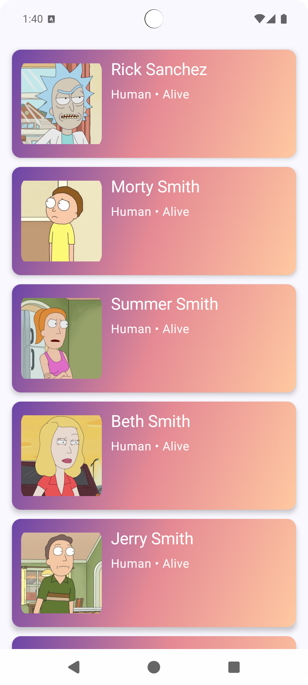
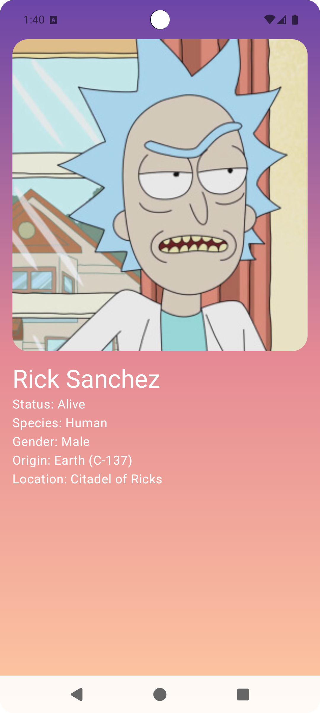
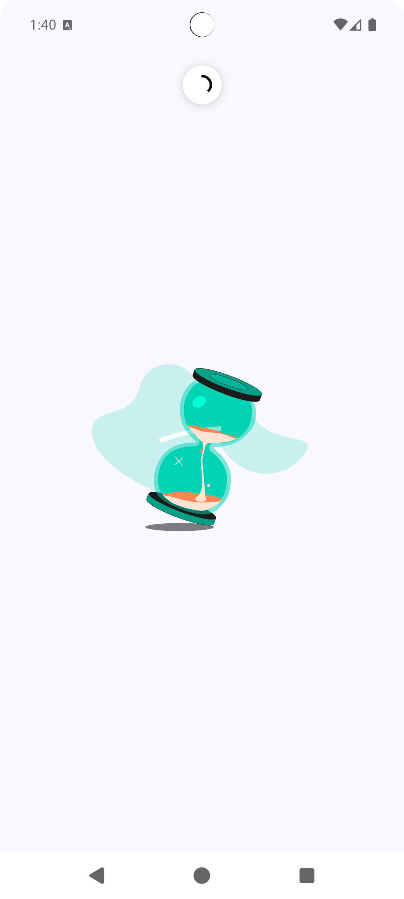
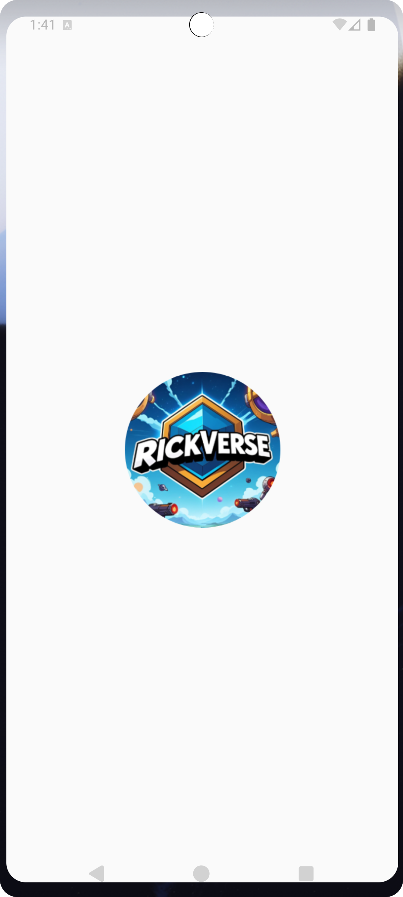

# RickVerse
RickVerse is an Android app built with Jetpack Compose, designed to explore characters from the Rick and Morty universe. It uses the Rick and Morty API (https://rickandmortyapi.com/) to fetch real-time data and showcases modern Android development practices.

---

## Features

- Browse Rick and Morty characters
- MVVM Architecture
- Dependency Injection (Hilt)
- Gradient UI with Material 3
- Lottie Animation
- Transition for navigation
- Clean Architecture
- API integration using Retrofit
- Unit Testing for ViewModel
- UI Test Placeholder

---

## Tech Stack

- Kotlin
- Jetpack Compose
- Hilt
- Retrofit
- Coroutines
- ViewModel + StateFlow
- Coil (for image loading)

---

<h2>Screenshots</h2>

<h4>Character List Screen</h4>


<h4>Character Detail</h4>


<h4>Loading Animation</h4>


<h4>App Logo</h4>



---

## Getting Started

### Prerequisites

- Android Studio Giraffe or newer
- Minimum SDK: 24
- Kotlin 1.9+

### Clone the repo

```bash
git clone https://github.com/akashofficialdev/RickVerse.git
cd RickVerse

